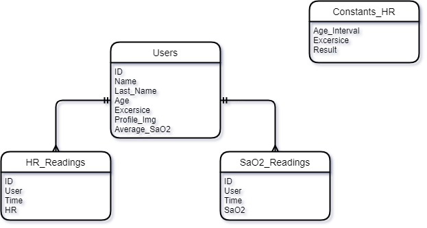

# IoTProyecto
Proyecto conjunto 

Descripción general del objetivo:

Construir un sistema de Iot

Pendientes:
- [] Cambiar diagrama entidad relación

- [] Añadir resto de la documentación al Git. (Completado parcialmente)

- [] Levartar error al momento de dar consulta

- [] Levartar error al momento de insertar datos

## Tips:

Algunos tips para que puedas hacer esto funcionar :D

Si quieres hacer **modelaciones de circuitos basicos**, usa: https://www.tinkercad.com/

Si tienes la db ya construida, y la quieres exportar, utiliza el siguiente
comando en tu terminal: `<mysqldump -u root -p db_name > filename.sql>` 

* Detalles a considerar:
    * Si estás en PowerShell, no va a funcionar ;(. Cambia a CMD
    * Si estás en Linux, agrega .exe al final de mysqldump

## Simulaciones de práctica:
* Circuito *inserte nombre*: https://www.tinkercad.com/things/hm5OmSE75J4-funky-duup-crift/editel?sharecode=f3NmukVP7lTklpvBShQAqAebfXOkqBxCWmoH0VkgSJc

## Objetivos del proyecto:

### Requerimientos: 

* El Arduino debe de mandar la siguiente información:
    * RitmoCardiaco (análoga)
    * Niveles de SaO2 en la sangre (analoga?)
    * Número de usuario 

* La computadora debe de:
    * Recibir la información que el Arduino le manda
    * Interpretarla
    * Limpiarla
    * Procesarla
    * Publicar en la base de datos los resultados
    * Funcionar como servidor local para el Dashboard

### Dashborad inteligente:
* Scatter plot
* Promedio semanal del ritmo cardiaco

### Diagrama entidad relación: 

